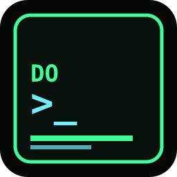

# Do Something

Fullscreen fake-busy hacker workspace. Covers every monitor. Type a seed
phrase and the hex of that phrase scrambles the colors, the copy, the
shapes, the radar contacts, and the IP ranges.

Move the mouse or press a key to quit.



## Quick start

### Linux (AppImage)

Download `Do_Something-x86_64.AppImage` from
[Releases](https://github.com/dedrixG/do-something/releases), then:

```bash
chmod +x Do_Something-x86_64.AppImage
./Do_Something-x86_64.AppImage
```

`chmod +x` is normal on Linux: browsers save a regular file, not a program.

### Windows

Download `DoSomething.exe` from
[Releases](https://github.com/dedrixG/do-something/releases) and double-click.

To install as a screensaver, use `DoSomething.scr` from the same release:
right-click → **Install**. Windows then calls:

| Flag | Meaning |
| --- | --- |
| `/s` (or no flag) | Fullscreen |
| `/c` | Seed prompt (saved for next time) |
| `/p <HWND>` | Preview (ignored; exits) |

The build is unsigned. SmartScreen may show “Windows protected your PC” —
**More info → Run anyway**. That is expected for a hobby release.

## Seeds

At launch you get a **SEED** prompt. Examples:

- `System Check` — teal/gold, pyramids, `25.11.*`, `system-check.local`
- `Bed time` — purple/green, needles, `51.193.*`, radar `BED-…`

Same phrase always produces the same world. Skip the prompt with
`--seed "Bed time"`.

## From source

Needs Python 3.10+ and [PySide6](https://pypi.org/project/PySide6/).

```bash
git clone https://github.com/dedrixG/do-something.git
cd do-something
```

### Fedora

```bash
sudo dnf install python3-pyside6
chmod +x start.sh
./start.sh
```

### pip

```bash
python3 -m venv .venv
.venv/bin/pip install -r requirements.txt
.venv/bin/python do_something.py
```

Useful flags:

```bash
./start.sh --seed "System Check"   # skip the prompt
./start.sh --windowed              # one window, not every monitor
./start.sh --dump-screens
./start.sh --version
```

Quit: move the mouse, click, or press a key (Esc always works).

## Packaging

```bash
# Linux AppImage (x86_64)
./scripts/build-appimage.sh

# Windows .exe / .scr (on Windows)
scripts\build-windows.bat
```

GitHub Actions builds both on `v*` tags and publishes a Release.

## License

MIT
